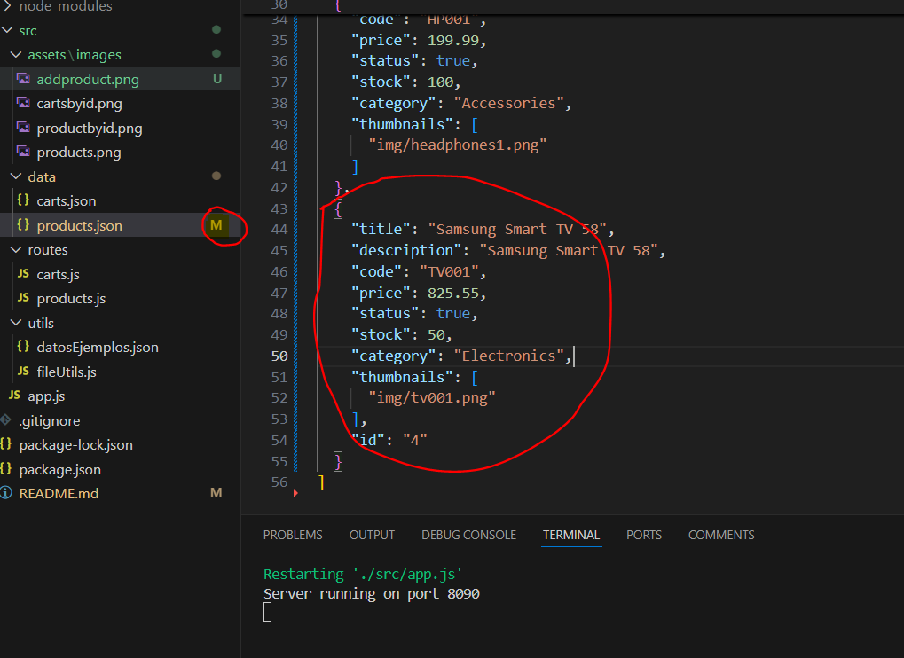

# Aplicación Backend E-Commerce **CoderHouse**

# E-Commerce

Desarrollar una aplicación de e-commerce para vender productos de un rubro a elección.

## Tabla de Contenidos
1. [Instalación](#instalación)
2. [Configuración](#configuración)
3. [Uso](#uso)
4. [Estructura del Proyecto](#estructura-del-proyecto)

## Instalación
### Requisitos previos
- mkdir ecommerce
- cd ecommerce
- npm init -y
- npm install express


### Instrucciones de instalación
1. Clonar el repositorio:
   ```sh
   git clone https://github.com/devjosilva/Backend.git

## Configuración
### Variables de entorno
`PORT`: El puerto en el que la aplicación se ejecutará (por defecto puerto: 8089).\
        Nota: por laburo tengo una APP instalada que utiliza puerto 8080


## Uso
- Inicia el servidor node app.js
### Endpoints de la API: Productos
**GET** `/api/products`: Listar todos los productos.\
        `limit`: Número máximo de productos a devolver.\
**GET** `/api/products/:pid`: Obtener un producto por ID.\
**POST** `/api/products`: Agregar un nuevo producto.
### Cuerpo de la solicitud
{
    "title": "string",
    "description": "string",
    "code": "string",
    "price": number,
    "status": boolean,
    "stock": number,
    "category": "string",
    "thumbnails": ["string"]
}
**PUT** `/api/products/:pid`: Actualizar un producto por ID.\
### Cuerpo de la solicitud
{
    "title": "string",
    "description": "string",
    "code": "string",
    "price": number,
    "status": boolean,
    "stock": number,
    "category": "string",
    "thumbnails": ["string"]
}
### Data
## Modelos de Datos
Product: Define la estructura de los productos.
Cart: Define la estructura de los carritos

## Conexión con MongoDB
La conexión a MongoDB se establece usando Mongoose en el archivo app.js, el archivo .env contiene la conexion a la base datos.

El archivo populare.js, pobla información de ejemplo en la base datos.

### Autenticación y autorización
La API no utiliza autenticación.

## Estructura del proyecto
```
ecommerce/
├── src/
│   ├── assets/
│   │   └── images/
│   │       ├── products.png
│   │       ├── productbyid.png
│   │       └── cartsbyid.png
│   │
│   ├── data/
│   │   ├── products.json
│   │   └── carts.json
│   │
│   ├── models/
│   │   ├── cart.model.js
│   │   ├── polulate.js
│   │   └── product.model.js
│   │
│   ├── routes/
│   │       ├── carts.js
│   │       ├── products.js
│   │       └── view.router.js
│   │
│   ├── utils/
│   │       ├── datosEjemplos.json
│   │       └── fileUtils.js
│   │
│   ├── views/
│   │       ├── carts.handlebars
│   │       ├── home.handlebars
│   │       └── realTimeProducto.handlebars
│   │
│   ├── .env
│   │
│   └── app.js
│           
│           
├── .gitignore    
├── package-lock.json    
├── package.json    
└── README.md    

```
## Carpetas y Archivos
```
src/models/: Modelos de datos que definen la estructura de los productos y carritos.
src/public/: Archivos estáticos como imágenes, scripts y hojas de estilo.
src/router/: Define las rutas de la API y las vistas para el frontend.
src/utils/: Helpers y scripts utilitarios.
src/views/: Plantillas Handlebars para la visualización de productos y la gestión en tiempo real.
src/app.js: Archivo principal que arranca el servidor y configura la aplicación.
.gitignore: Lista de archivos y carpetas que Git debe ignorar.
package.json: Configuración del proyecto y dependencias.
README.md: Documentación del proyecto.

```




